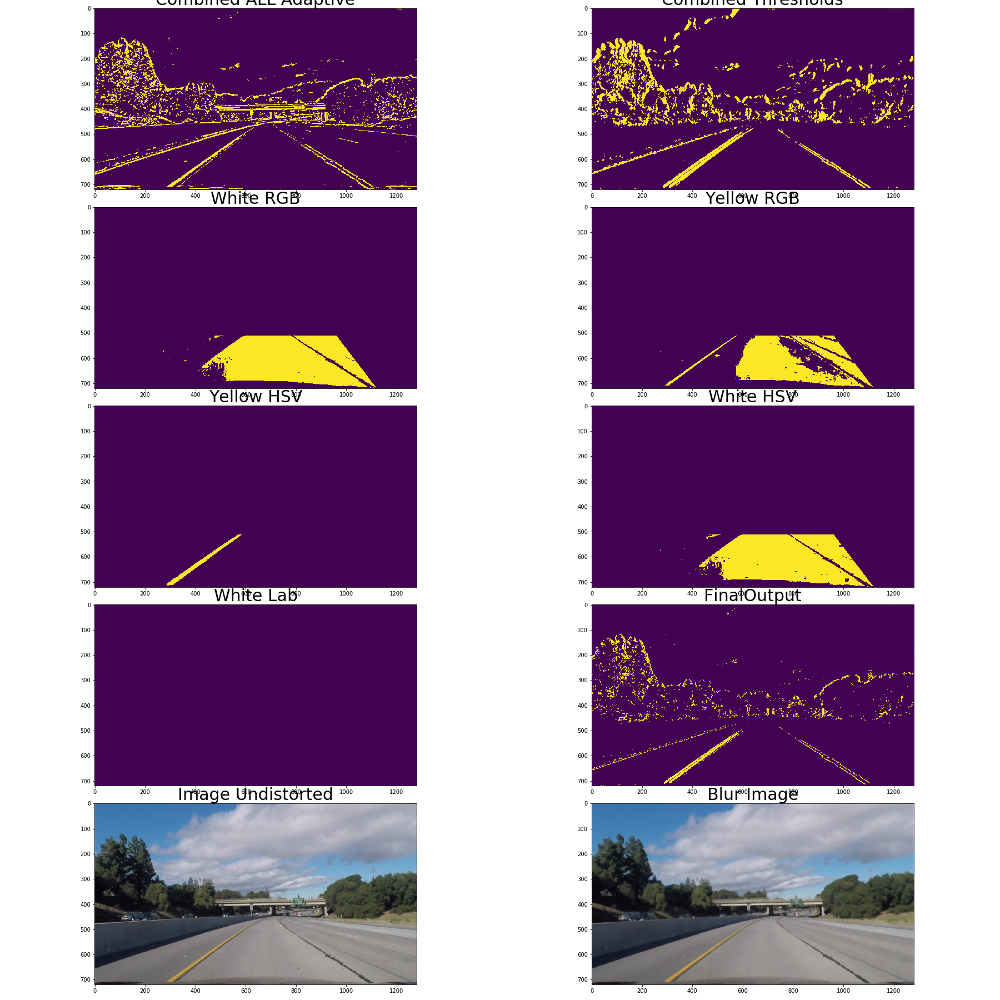
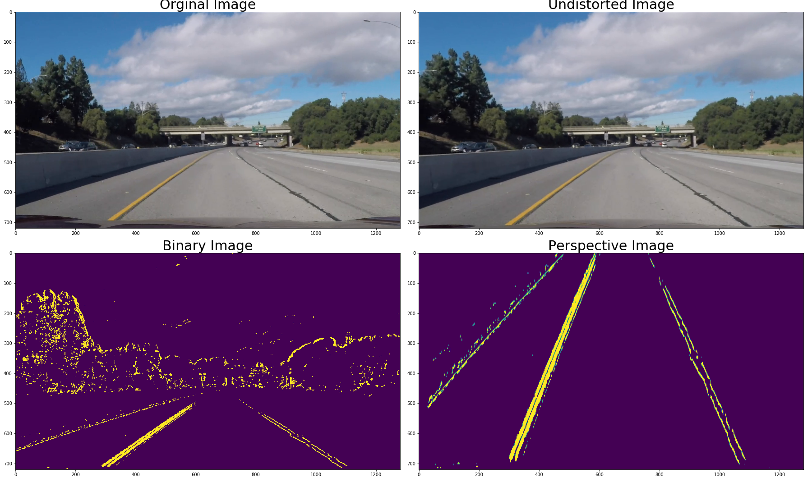

## Self Driving Cars - Project Advanced Finding Lanes


---

**Advanced Lane Finding Project**

The goals / steps of this project are the following:

* Compute the camera calibration matrix and distortion coefficients given a set of chessboard images.
* Apply a distortion correction to raw images.
* Use color transforms, gradients, etc., to create a thresholded binary image.
* Apply a perspective transform to rectify binary image ("birds-eye view").
* Detect lane pixels and fit to find the lane boundary.
* Determine the curvature of the lane and vehicle position with respect to center.
* Warp the detected lane boundaries back onto the original image.
* Output visual display of the lane boundaries and numerical estimation of lane curvature and vehicle position.

---


### Processing Pipeline
In order to detect lane lines in a video of a car driving on a road, and then generate an annotated video with the detected lane overlaid, we need an image processor that performs these two tasks–detection and annotation–on every frame of the video. That image processor encompasses a "processing pipeline."

The good pipeline and having good algorithm which will find the lane lines depends on the following tasks.

    1.Camera Calibration
    2.Deriving Binary Image 
    3.Perspective Tranformation 
    4. Algorithm which implement the sliding window ( first time search ) and fitting by previous fits and also covering the whole possible scenarios which will come ( like noise frames, lost lines , low level of features on the frames for extracting of the line etc.
    
All the Code for implementing the pipeline from calculating the matrix and distrortion coefficients are included in **Self_Driving_Cars_Advanced_Lane_Findings_Solution_3_Videos.ipynb**

For each key point of the rubric and also for better understanding some tasks are divided in few function. I use classes but i did not extend to inherit one from another, each class is independed. 


### Camera Calibration

#### 1. Briefly state how you computed the camera matrix and distortion coefficients. Provide an example of a distortion corrected calibration image.

Camera calibration measures the distortion inherent in cameras that utilize lenses so that the images taken with the camera can be corrected by removing the distortion. A standard way to do this is to measure the distortion the camera imposes on standard images of known geometry. Checkerboard patterns are useful for this tasks because of their high contrast, known geometry, and regular pattern.

For performing and computing camera matrix and distortion coeficients there is a class Callibration.  Using
cv2.findChessboardCorners, the corners points are stored in an array imgpoints for each calibration image where the chessboard could be found. The object points will always be the same as the known coordinates of the chessboard with zero as 'z' coordinate because the chessboard is flat. The object points are stored in an array called objpoints. 

I then used the output objpoints and imgpoints to compute the camera calibration and distortion coefficients using the cv2.calibrateCamera function which are then pickled and saved for later use. 

Image using chessboard image is used all together later in the images. 


### Pipeline (single images)

#### 1. Provide an example of a distortion-corrected image.

For applying matrix and distrotrtion coefficients i created the class UndistortImage. This class is init with Calibration class with which the matrix and distrotion coefficients are loaded and used with the method in this class undistort_image() in which is used cv2.undistort. Also here in this class i perform bluring of the undistorted image which is used later on in creating of the binary image. 

##### Distorted and Undistorted 


#### 2. Describe how (and identify where in your code) you used color transforms, gradients or other methods to create a thresholded binary image.  Provide an example of a binary image result.

As we have three videos for testing our knowledge which are different, have a lot of noise ( brightness, low level of features about the lines etc), so we need to extract as good we can binary image which will decrease this level of noise. 

For deriving binary image as per study we have few methods using opencv function like Sobel gradients, Thresholds( specially cv2.adaptivethreshold) , finding the lower and upper range and deriving the mask. 

This part of the pipeline is implementent in few classes : AdaptiveThreshold, ColorRanges, Gradients and BinaryImage( which combine all of them) 

1. AdaptiveThreshold class: in this class is impelmented opencv function cv2.adaptivethreshold

```python
def adaptive_thresholds(self, image):
        rgb_r = image[:,:,0]
        hls_s = cv2.cvtColor(image, cv2.COLOR_RGB2HLS)[:,:,2]
        hsv_v = cv2.cvtColor(image, cv2.COLOR_RGB2HSV)[:,:,2]
        lab_l = cv2.cvtColor(image, cv2.COLOR_RGB2LAB)[:,:,0]
            rgb_r_a = cv2.adaptiveThreshold(rgb_r,self.a_thresholds[0], cv2.ADAPTIVE_THRESH_GAUSSIAN_C, cv2.THRESH_BINARY,self.a_thresholds[1] ,self.a_thresholds[2])
        hls_s_a = cv2.adaptiveThreshold(hls_s,self.a_thresholds[0], cv2.ADAPTIVE_THRESH_GAUSSIAN_C, cv2.THRESH_BINARY,self.a_thresholds[1] ,self.a_thresholds[2])
        hsv_v_a = cv2.adaptiveThreshold(hsv_v,self.a_thresholds[0], cv2.ADAPTIVE_THRESH_GAUSSIAN_C, cv2.THRESH_BINARY,self.a_thresholds[1] ,self.a_thresholds[2])
        lab_l_a = cv2.adaptiveThreshold(lab_l,self.a_thresholds[0], cv2.ADAPTIVE_THRESH_GAUSSIAN_C, cv2.THRESH_BINARY,self.a_thresholds[1] ,self.a_thresholds[2])
        #Combining all of them 
        combined = np.zeros_like(rgb_r_a)
        combined[((rgb_r_a >= 1) | (hls_s_a >= 1) | (hsv_v_a >= 1) | (lab_l_a >= 1)) ] = 1
        return combined
```

As we can see from this method which is part of the class AdaptiveThreshold i use few color spaces - their channels ( RGB - R Channel , HLS - S Channnel, HSV- V Channel,  and LAB- L channel). Based on a lot of testing and as i mention that we have a lot of frames which are not consistent it was very difficult to extract using only one color space. For example LAB - L Channel here help me basically for finding the white lane lines. 

To be honest before defining the parameters for this function of opencv ( cv2.adaptiveThreshold) i perform a lot of tests and this parameters give me a best results adaptive_thresholds_par=(38,29,-10). 

2. ColorRanges: 

This class use HLS, LAB and RGB color spacecs for finding the yellow and white lane line. Choosing the lower limit and upper limit for white and yellow in this color spaces i found out that it is very noise if we focus purely on some thresholds, so because we are interested only on area of the image from the whole image i first create mask and cover the part of the image which is not our intereest ( the vetrices are taken from Perspective Transofrm which are used for finding the birds eye image) and having that points i calculate the area for that vetrices using shoelace formula ( implemented in the method polygonarea in this class). This area later is used for finding average pixel value per channel which help me for better fittting the color spaces. 

3. Gradients:

This class use Sobel and combine as per the class for deriving binary image but here i dont use pure undistored image i use blured using cv2.gauusianBlur. But what i change here is instead using binary image or only one color space i make combination of few color spaces for deriving Combined Gradiedients separately so later on i combine them which give me good result instead as i mention of using one. 
##### Binary Image Project Frames ( picked randomly) 


##### Binary Image Harder Challenge Frames ( picked randomly) 


##### Binary Image  Challenge Frames ( picked randomly) 



#### 3. Describe how (and identify where in your code) you performed a perspective transform and provide an example of a transformed image.


So we come to finding perspective image which by my opinion is crucial because we need to take in consideration the quality of the binary image we have, the noise and also the type of the road - are we want to look long in the distance if we are driving on highway or we need to look short if we drive through the forest. And also i found that we need to adjust how far we need to look based on the line. 

This is implemented in the class PerspectiveTransform which take binary image and based on the src and dst points create that perspective transform. 

As we have three videos i found very difficult as i mention above to find a good ratios for src and dst. But what i need was is for highway road i need src and dst which will create perspective image with longer distancee and wider but for road through the forest we need shorter distance ( by my opinion that is how it need to be as we take in consideration we wont drive faster through that road)


##### Perspective Image Project Frames ( picked randomly) 


##### Perspective Image Harder Challenge Frames ( picked randomly) 


##### Perspective Image  Challenge Frames ( picked randomly) 


#### 4. Describe how (and identify where in your code) you identified lane-line pixels and fit their positions with a polynomial?

So this is the last piece which take all previuos outputs and use the technique sliding windows and search from priors for finding the lane lines. 

I designed the algoritham in two clasess Drive class which handle sliding windows, search from the prior , drawing the frames and Line class ( one for each line ) which handle all the calculation : polynomial fit, the line , curvaature of the line, converting pixels to metter and most important the whole logic of the alogoritm - which line is good, when to reset, what if we have a low level of features and the most important in the Algoritham is that each line is tracked separatelly and not depend on the other. 


Walktrough the algorithm:

1. Initialisatiion of two lines using Line class and used in Drive class so we have them for tracking.
2. Line class ( i think about each line later on) have a bool variable if it is first frame which is init is False and changed when we start to Drive. 
3. This means that if the line is first we are using sliding window for finding the lane lines on the image so this lane lines are our starting point which we improve and keep them if they are good. So with this for each line is calculated np.polyfit and assign to current fit variable. In Line class i have variable best_fit which holds the last best_fit ( i will explain later ) and also with this i append this current fit to collection. So we are ready to go on next level. 

4. Having the histtogram and finding the nonzero inds from Drive Class each line get their nonzeros throuh method in Line class if_there_is_line(). 
5. This method is first defensive mechanisam to know what we have and how we will continue. This method have if/else statement which check 
**If the list with nonzero inds is empty** 
    - if it is true that means that we need to restart, but because as i mention we have a lot of frames with a lot of noise i create counter which count how many times we enter here so if we hit 25frames equal of 1 second that means we need to reset but each time when it hit here i take from previous frame nonzeros so we have the same line , same curvature. 
Also below is the method where we can see the counter and the danger_message variable which i use later on for drawing on the frame for information when we have this situation, but also this counter is reseted each time when this if and lenght if(below ) are not true
     
**if the length of this list is not empty but lower of some threshold**
    - This is also crucial point which protect us of list of nonzeros which is like empty have maybe a noise and gives us false information or maybe it is empty but the next will be good so not to reset just like that i still give the chance. I choose this amount to be 1000 length ( based on my testing this was very good threshold because lot of frames give me on average above 10000 length of nonzeros list). 
    
**if above are false**
    - that means we hit a line so from know on we need to work on line and compare. So when we hit here i assign this values of nnonzeros to variables in Line class ally, allx which are always used for computing np.polyfit --- current_fit 
    
 ```python
 def if_there_is_line(self, x, y):
        f =lambda x: False if list(x) else True # Reversed True or False if the list is empty
        if (f(x) or f(y)):
            self.we_have_low_features = True
            self.keep_roi=False
            self.danger_driving += 1
            if self.danger_driving == 25:
                self.we_dont_have_line = True
                self.we_have_low_features = True
                self.danger_message = True
        elif len(x) < 1000:# If the list is smaller than 500 ( threshold) discard that and do not assign the values for np.polyfit
            self.we_have_low_features = True
            self.we_dont_have_line = False
            self.keep_roi = False
            self.danger_driving =0
            self.danger_message = False
        else:
            self.we_have_low_features = False
            self.we_dont_have_line = False
            self.danger_driving = 0
            self.danger_message = False
            self.allx, self.ally =  x, y
 ```
  
6. So we pass the first frame and we pass the empty list nonzeros and also the length is good, we have the best_fit, collection of current fits which is set on 50 last ( 2 seconds which is enogh for this small project).
    So if we suppose the second frame come first check is calculating the difference with best fit which is the previous fit( from the first frame ) and i have condition that difference not to be greater in absolute values **self.diffs_pixel_previous = np.absolute(self.current_fit - self.best_fit)**. 
    - if this is false that means that the second frame is close to the first so we can continue, but here before i continue to the drawings and getting the next frame i assign this current fit as best fit. And most important by my opinion is here i clean the collectionn because if this condition is hit that means that they are really close so if for example this is hit always we always we will have collection with one fit. 
    
   - if this is true so here we have problem - which can come maybe of noise image because this type of difference of frame to frame is not possible ( maybe ! :) ).
       So i have another condition with which i compare the current fit with the last in the collection list (if we are here first time this is the previous we do that above but i want to track what can be the problem). So by default for the first time this is true so i append this current fit to the list on the left and assign as current fit to be the best fit but remove from the collection list that best fit . So when the next frame comes we are comparing with the bestfits and if there is a difference we check again if that difference is between current fit and previous bad fit. So again if this is true we assign the bestt fit ( kept before as current fit and put on the list this current fit). If we hit this condition for 25 frames that means we need reset because something is bad. 
       

#### 5. Describe how (and identify where in your code) you calculated the radius of curvature of the lane and the position of the vehicle with respect to center.

Calculation of the Curvature is done separately for each line in the Line class: 

```python
def update_polynomial(self, ploty, ym_per_pix, xm_per_pix):
        y_eval = np.max(ploty)
        if (self.first_frame or self.reset):
            self.reset = False
            self.first_frame = False
            self.keep_roi = True
            self.current_fit  = np.polyfit(self.ally, self.allx, 2)
            self.best_fit = self.current_fit
            self.recent_fits_pixel.append(self.current_fit)
            self.current_fits_list.append(self.current_fit)#For Debug
        else:
            self.current_fit  = np.polyfit(self.ally, self.allx, 2)
            self.current_fits_list.append(self.current_fit)#For Debug
            self.diffs_pixel_previous = np.absolute(self.current_fit - self.best_fit)
            self.saved_diffence_previous.append(self.diffs_pixel_previous) #For Debug
            if self.we_have_low_features:
                self.recent_fits_pixel.clear()
                self.best_fit = self.current_fit                                                                    
                self.recent_fits_pixel.append(self.current_fit)
                self.keep_roi = False
                self.maximum_frame_check_reset = 0
                self.maximum_frame_check_switch = 0
                self.warning_message = True
                if self.we_dont_have_line:
                    self.reset = True
            elif (self.diffs_pixel_previous[0] > 0.001 or self.diffs_pixel_previous[1] > 1.0 or self.diffs_pixel_previous[2] > 100.): 
                self.frames_averagee.append(self.frames)#For Debug
                self.warning_message = True
                self.diffs_pixel_average = np.absolute(self.current_fit - self.recent_fits_pixel[-1])
                if (self.diffs_pixel_average[0] > 0.001 or self.diffs_pixel_average[1] > 1.0 or self.diffs_pixel_average[2] > 100.):
                    self.saved_diffence_average.append(self.diffs_pixel_average)#For Debug
                    self.keep_roi = False
                    self.saved_danger.append(self.frames)#For Debug
                    self.recent_fits_pixel.appendleft(self.current_fit)
                    self.recent_fits_pixel.pop()
                    self.current_fit = self.best_fit
                    self.maximum_frame_check_reset += 1
                    self.warning_message = True
                    if self.maximum_frame_check_reset == self.buffer_len//2:
                        self.where_happen_reset.append(self.frames)
                        self.maximum_frame_check_reset = 0
                        self.reset = True
                        self.recent_fits_pixel.clear()
                else:
                    self.frames_check_here.append(self.frames)#for debug
                    self.keep_roi = False
                    self.recent_fits_pixel.appendleft(self.current_fit)
                    self.current_fit = self.best_fit
                    self.maximum_frame_check_reset += 1
                    if self.maximum_frame_check_switch == self.buffer_len//4:
                        self.maximum_frame_check_switch = 0
                        self.current_fit = self.average_fit
                        self.best_fit = self.current_fit
                        self.recent_fits_pixel.clear()
                        self.recent_fits_pixel.append(self.current_fit)
                        
            else:
                self.recent_fits_pixel.clear()
                self.best_fit = self.current_fit                                                                    
                self.recent_fits_pixel.append(self.current_fit)
                self.keep_roi = True
                self.maximum_frame_check_reset = 0
                self.maximum_frame_check_switch = 0
                self.warning_message = False
        self.frames +=1
        self.final_fit.append(self.current_fit)# For Debug
        self.last_fit_pixel = self.current_fit[0]*ploty**2 + self.current_fit[1]*ploty + self.current_fit[2]
        self.last_fit_cr = np.polyfit(ploty*ym_per_pix, self.last_fit_pixel*xm_per_pix, 2)
        self.radius_of_curvature = ((1 + (2*self.current_fit[0]*y_eval + self.current_fit[1])**2)**1.5) / np.absolute(2*self.current_fit[0])
        self.radius_of_curvature_meter = ((1 + (2*self.last_fit_cr[0]*y_eval*ym_per_pix + self.last_fit_cr[1])**2)**1.5) / np.absolute(2*self.last_fit_cr[0])
        
        
```

#### 6. Provide an example image of your result plotted back down onto the road such that the lane area is identified clearly.

I implemented this step in lines # through # in my code in `yet_another_file.py` in the function `map_lane()`.  Here is an example of my result on a test image:

##### Final Gif  Project Frames ( picked randomly) 


##### Final Gif  Harder Challenge Frames ( picked randomly) 


##### Final Gif    Challenge Frames ( picked randomly) 


---

### Pipeline (video)

#### 1. Provide a link to your final video output.  Your pipeline should perform reasonably well on the entire project video (wobbly lines are ok but no catastrophic failures that would cause the car to drive off the road!).

Here's a [link to my video result for PROJECT VIDEO](project_video_solution.mp4)
Here's a [link to my video result for HARDER CHALLENGE VIDEO](harder_challenge_video_solutioon.mp4)
Here's a [link to my video result for CHALLENGE VIDEO](challenge_video_solution.mp4)

---

### Discussion

#### 1. Briefly discuss any problems / issues you faced in your implementation of this project.  Where will your pipeline likely fail?  What could you do to make it more robust?

All tasks have their difficulties from finding good binary image through perspective image and the algorithm for finding lane lines. If we change road we need to tweak the perspective tranform parameetrs because here are coordinated with the road and the projects we have. 

Making this much more roboust is taking a lof different statistics about the curvature, lane distance which can help us for much more automated process for deefining some of the parameters. Also the use of deep neural networks basically CNN or CapsNet can help us for finiding better features. 
